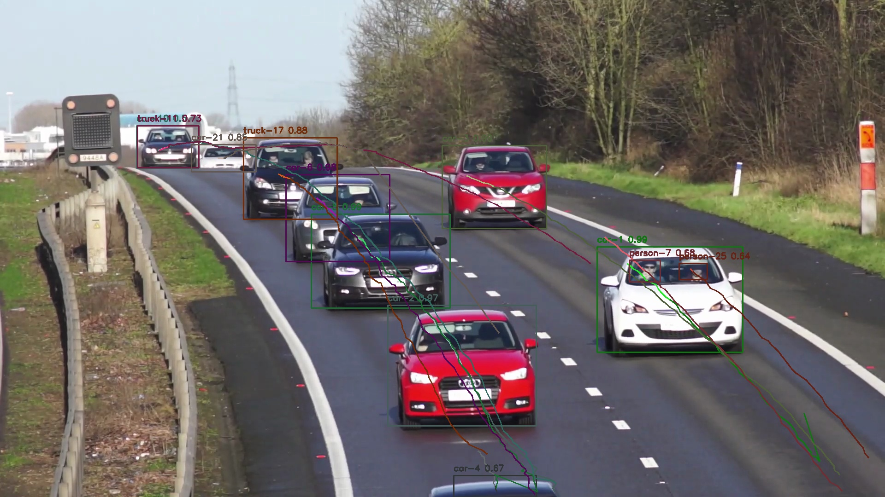

# 🎯 Video Object Tracking and Trajectory Visualization

Fun little full-stack application for **uploading videos**, running **object detection and tracking** (YOLOv4 + Deep SORT), and **visualizing object trajectories** over time.

🚀 Built with:
- Flask (web interface + backend)
- TensorFlow (YOLOv4 object detection + Deep SORT for tracking)
- PostgreSQL (video & frame metadata)
- Docker (multi-container setup)
- OpenCV (frame processing and rendering)



## 📸 Features

- 🎞 **Video Upload**: Drag-and-drop or select `.mp4`, `.avi`, etc.
- 🧠 **Object Detection**: Powered by YOLOv4 and Deep SORT
- 🧭 **Trajectory Rendering**: Draws bounding boxes and motion paths
- 📊 **Frame & Detection API**: Browse video metadata, frame numbers, and detection results
- 📦 **PostgreSQL Integration**: Store videos, frames, and detections
- 🔍 **Interactive UI**: Visualize specific frames, fetch image outputs, and trigger reprocessing

---

## 🛠️ Getting Started
### 0. Prerequisites
- Installed docker

### 1. Clone the Repo

```bash
git clone https://github.com/yourusername/object-tracking-app.git
cd object-tracking-app
```
### 2. Build and Run Docker Containers

```bash
docker-compose up --build
```

### 3. Access the Web Interface
- Open your browser and navigate to `http://localhost:5001` or http://0.0.0.0:5001/
- Drag and drop a video file or select one from your filesystem to upload.
- Choose specific frame numbers to visualize.
